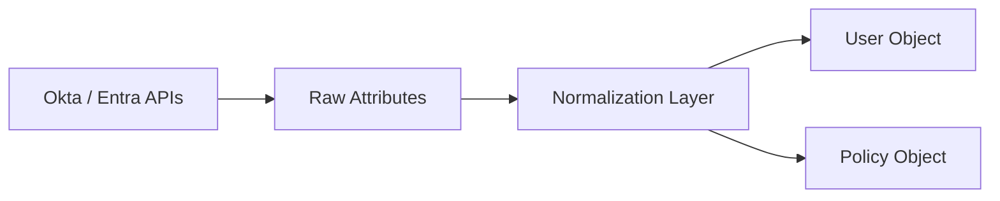

# Leen IDP Model Extension – Candidate Submission  
**Candidate:** Om Mistry  
**Date:** October 2025

---

## 1. Executive Summary

This document extends Leen’s identity provider (IDP) model to support additional security-relevant user attributes and introduces a normalized `policy` object for access control review use cases. The mappings focus on harmonizing Okta and Microsoft Entra ID fields into a consistent schema that can power investigations such as: *Who has MFA configured?*, *Which users are protected by sign-on restrictions?*, and *Do tenant policies enforce secure authentication?*

The key design choice is flattening provider-specific constructs (like Okta policy rules) into a simpler, queryable normalized form that enables downstream analytics and platform logic without vendor-specific interpretation.

---

## 2. Approach

### Data Collection Principles
- **Start from the user**: collect core identity attributes + MFA status to support investigation use cases
- **Normalize early**: vendor complexity is abstracted into small consistent fields
- **Design for queryability**: policies become first-class objects, not just metadata
- **Treat gaps explicitly**: unsupported vendor data is surfaced as limitations

### Relevant API Sources

| Area | Okta | Microsoft Entra ID |
|------|------|---------------------|
| User profile | `/api/v1/users` | `/v1.0/users` |
| MFA enrollment | `/users/{id}/factors` | `/beta/reports/credentialUserRegistrationDetails` (preferred) |
| Admin inference | `/users/{id}/roles` | `/roleManagement/directory/roleAssignments` |
| Policies | `/api/v1/policies` (+ `/rules`) | `/identity/conditionalAccess/policies` |

---

## 3. Normalized User Object

| Normalized Field | Okta Source | Entra Source | Notes |
|------------------|-------------|--------------|-------|
| `id` | `id` | `id` | Native provider ID |
| `email` | `profile.email` | `mail` or `userPrincipalName` | Guaranteed available |
| `user_principal_name` | `profile.login` | `userPrincipalName` | |
| `display_name` | `firstName` + `lastName` | `displayName` | |
| `status` | `status` | `accountEnabled` | Mapped to `active` / `disabled` / `locked` |
| `user_type` | `type.id` | `userType` | Normalized to employee / guest / service |
| `is_admin` | roles assignment | role assignment | Boolean only |
| `created_at` | `created` | `createdDateTime` | |
| `last_sign_in` | `lastLogin` | signInActivity (if available) | |
| `mfa_enrolled` | factors exist & active | `isMfaRegistered` | boolean |
| `mfa_methods` | factorType[] | methodsRegistered[] | array |

> Note: `manager_id` intentionally omitted for parity and consistency

---

### Example Normalized User Object

```json
{
  "id": "00u1a2b3c4d5e6",
  "provider": "okta",
  "email": "jdoe@company.com",
  "user_principal_name": "jdoe@company.com",
  "display_name": "John Doe",
  "status": "active",
  "user_type": "employee",
  "is_admin": false,
  "created_at": "2024-01-15T10:30:00Z",
  "last_sign_in": "2024-10-23T14:22:00Z",
  "mfa_enrolled": true,
  "mfa_methods": ["totp", "push_notification"]
}
```

---

## 4. Normalized Policy Model

### Why it matters (product framing)
A normalized policy model enables:
- Answering **who is actually protected by MFA** (vs. who merely *could* be)
- Detecting over-broad access
- Auditing location-based restrictions and risk controls
- Confirming that “strong authentication” is enforced at a tenant level

### Policy Types
| Normalized Type | Okta Equivalent | Entra Equivalent |
|------------------|------------------|------------------|
| `sign_on` | Sign-on Policies (flattened rules) | Conditional Access Policies |
| `mfa_enrollment` | MFA Enrollment Policies | Authentication Methods Policy |
| `password` | Okta Password Policy | Entra: unsupported via Graph (noted only) |

---

### Example Normalized Policy Object

```json
{
  "id": "a1b2c3",
  "provider": "entra_id",
  "policy_type": "sign_on",
  "name": "Require MFA for All Users",
  "enabled": true,
  "applies_to": {
    "users": [],
    "groups": [],
    "everyone": true
  },
  "conditions": {
    "locations": { "included": [], "excluded": [] },
    "device_platforms": [],
    "risk_levels": ["medium", "high"]
  },
  "requirements": {
    "mfa_required": true,
    "block_access": false
  }
}
```

---

## 5. Source → Normalized Flow Diagram



---

## 6. Known Limitations

| Area | Limitation | Impact |
|------|------------|--------|
| Entra password policy | Not exposed via Graph v1.0 | Marked as unsupported |
| Sign-in activity | Premium license dependency | May be null |
| Admin detection | Requires second call | Cached recommended |
| Policy targeting | Group names require lookup | Stored by ID only |

---

## 7. Developer Notes

- Entra conditional access requires `Policy.Read.All`
- MFA bulk data in Entra is only stable in beta for now
- Okta + Entra rate limiting differs significantly (batching required)
- Sync frequency can be low for policies (daily) and higher for status (hourly)
- Reduced surface area improves queryability and downstream modeling

---

## Conclusion

This model normalizes the most security-relevant identity attributes and makes policy evaluation queryable across Okta and Entra. By flattening provider constructs and surfacing unsupported areas explicitly, this design keeps Leen’s IDP layer consistent, auditable, and suitable for future enrichment without rework.
